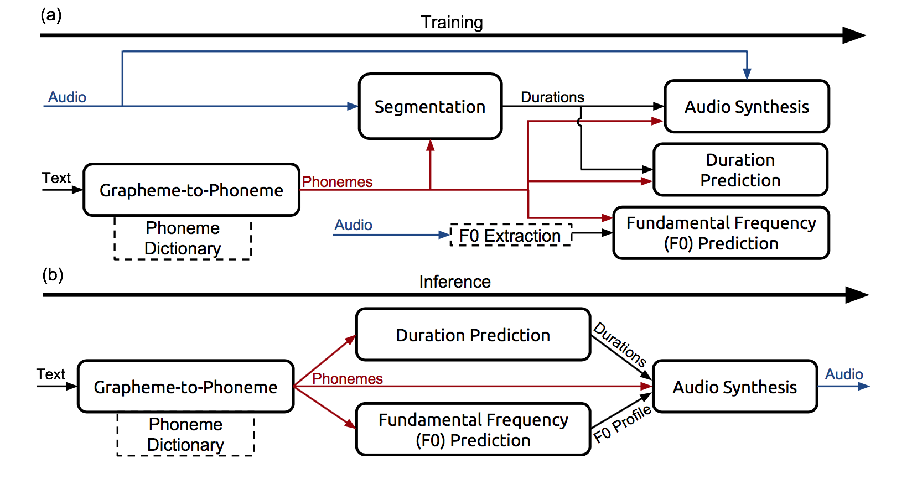

# Deep Voice: Real-time Neural Text-to-Speech

Link: https://arxiv.org/abs/1702.07825

Authors: Arik et al. 2017

Institution: Baidu Research

## Background Materials

- [Deep Voice: Real-Time Neural Text-to-Speech for Production](http://research.baidu.com/deep-voice-production-quality-text-speech-system-constructed-entirely-deep-neural-networks/)
- [Baidu Deep Voice explained: Part 1 — the Inference Pipeline](https://blog.athelas.com/paper-1-baidus-deep-voice-675a323705df)
- [Baidu Deep Voice explained Part 2 — Training](https://blog.athelas.com/baidu-deep-voice-explained-part-2-training-810e87d20047)

## What is this paper about?

Deep Voice is text-to-speech system constructed entirely from deep neural network.

Deep Voice consists of 5 building blocks,

- segmentation model for locating phoneme boundary
- grapheme-to-phoneme conversion model
- phoneme duration prediction model
- fundamental frequency prediction model
- audio synthesis model

## What makes this paper different from previous research?

- Deep Voice is production-ready text-to-speech architecture that contains all parts of a system in DNN, whereas previous studies focused on part of a system.
- Since they use DNN for all component, laborious and domain specific feature engineering is tremendously reduced.
- Only simple features are used. This makes the same architecture applicable to new datasets. They note retraining against a new dataset without changes of hyperparameter takes a few hours whereas traditional approach require days or weeks of tuning.
- For segmentation model they propose new way based on DNN with connectionist temporal classification (CTC) loss to detect phoneme boundary.
- Performance of inference in WaveNet is improved up to 400x, that is faster than real time.

## How this paper achieve it?

System architecture.

Inference pipelines are,

1. text -> graphene-to-phoneme model
1. phoneme -> phoneme duration medel
1. phpneme -> F0 prediction model
1. F0 -> audio synthesis model (as local conditioning)

Training pipelines are,

1. text -> graphene-to-phoneme model
1. audio -> segmentation model (to annotate voice data with phoneme boundaries)
1. phoneme boundaries -> phoneme duration model
1. F0 extraction from audio & segmentation -> F0 prediction model
1. audio annotated with phonemes, phoneme duration, F0 -> audio synthesis model

### Grapheme-to-Phoneme Model

- based on the encoder-decoder architecture (Yao & Zweig, 2015)
- multi-layer bidirectional encoder with a gated recurrent unit (GRU) nonlinearity and an equally deep unidirectional GRU decoder (Chung et al., 2014)
-  phoneme error rate of 5.8% and a word error rate of 28.7%, on par with previous results.

### Segmentation Model

- convolutional recurrent neural network architecture (Amodei et al., 2015)
- connectionist temporal classification (CTC) loss function
- Input audio is featurized by 20 MFCCs with a ten millisecond stride
- phoneme pair error rate of 7%
- They found phoneme boundaries do not have to be precise, and randomly shifting phoneme boundaries by 10-30 milliseconds makes no difference in the audio quality

### Phoneme Duration and Fundamental Frequency Model

- The architecture comprises two fully connected layers with 256 units each followed by two unidirectional recurrent layers with 128 GRU cells each and finally a fully-connected output layer.
- The final layer produces three estimations for every input phoneme: the phoneme duration, the probability the phoneme is voiced, and 20 time-dependent F0 values

### Audio Synthesis Model

- variant of WaveNet
- perform better, train faster, and require fewer parameters if first encode the inputs with a stack of bidirectional quasi-RNN (QRNN) layers (Bradbury et al., 2016)
- receptive field size may not be important in determining model quality
- naturalness of TTS mainly depends on duration and fundamental frequency prediction. DeepVoice  have not meaningfully progressed in that regard.
- DeepVoice is comparable with WaveNet with full set of features.

### Optimizing Inference

- WaveNet inference takes for minutes or hours for short utterances
- optimizing by avoiding recomputation, doing cache-friendly memory accesses, par- allelizing work via multithreading with efficient synchronization, minimizing nonlinearity FLOPs, avoiding cache thrashing and thread contention via thread pinning, and using custom hardware-optimized routines for matrix multiplication and convolution.
- the latency for a CUDA kernel launch (50 μs) and time to load the entire model from GPU memory leads to 1000X slower than real-time on GPU

## Dataset used in this study

- internal English speech database containing approximately 20 hours of speech data segmented into 13,079 utterances
- Blizzard 2013 data (Prahallad et al., 2013)

### features

- phonemes with stress annotations
- phoneme durations
- fundamental frequency (F0)

### lexicon to train grapheme-to-phoneme model

- CMUDict (all words that do not start with a letter, contain numbers, or have multiple pronunciations are removed from it)

## Implementations

- no published implementation
- they use Tensorflow
- [PeachPy](https://github.com/Maratyszcza/PeachPy) to implement custom AVX assembly kernels for matrix- vector multiplication

## Further Readings

- [Fast Wavenet Generation Algorithm](https://arxiv.org/abs/1611.09482)
