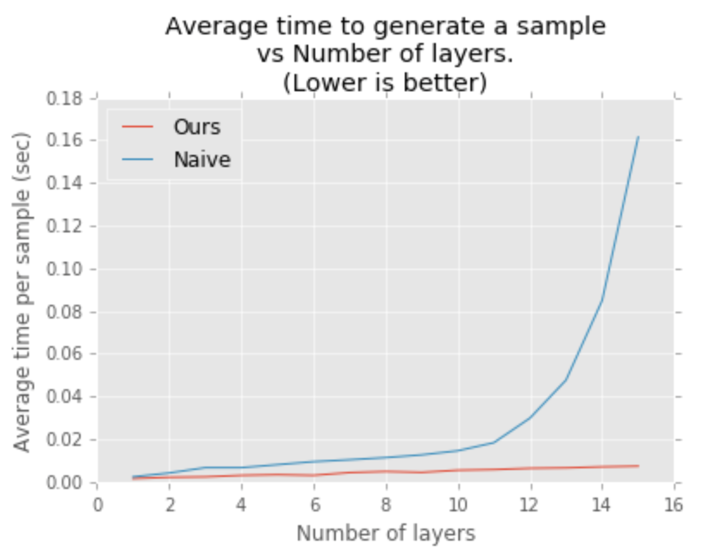

# FAST WAVENET GENERATION ALGORITHM

Link: https://arxiv.org/abs/1611.09482

Authors: Paine et al. 2016

Institution: University of Illinois, IBM Thomas J. Watson Research Center

## Background Materials

- [WaveNet: A Generative Model for Raw Audio](https://arxiv.org/abs/1609.03499)

## What is this paper about?

Audio generation algorithm optimization of WaveNet.

## What makes this paper different from previous research?

- Computation complexity is reduced from O(L^2) to O(L)

## How this paper achieve it?

A single output sample is generated from cached state of previous timesteps.
The cached state can be viewed as "recurrent" state with analogy of RNN.

The algorithm has two components.

- Generation Model
- Convolution Queue

Audio generation steps are,

1. initialize generation model with pre-trained weights
1. initialize the convolution queues with recurrent states with zero
1. for each output sample
  1. Pop Phase: the first recurrent state is popped off of queue.
  1. feed the recurrent state to generation model
  1. compute current output with recurrent states and input
  1. Push Phase: computed recurrent states are pushed into queues

### Complexity Analysis

  | complexity  | Fast WaveNet | naive WaveNet |
  |:-----------:|:------------:|:-------------:|
  | computation |  O(L)        |     O(L^2)    |
  | scape       |  O(2^L)      |     O(L^2)    |

### Performance Experiment

## Implementations

- https://github.com/tomlepaine/fast-wavenet
- https://github.com/ibab/tensorflow-wavenet ("naive implementation" this paper refers to)

## Further Readings
