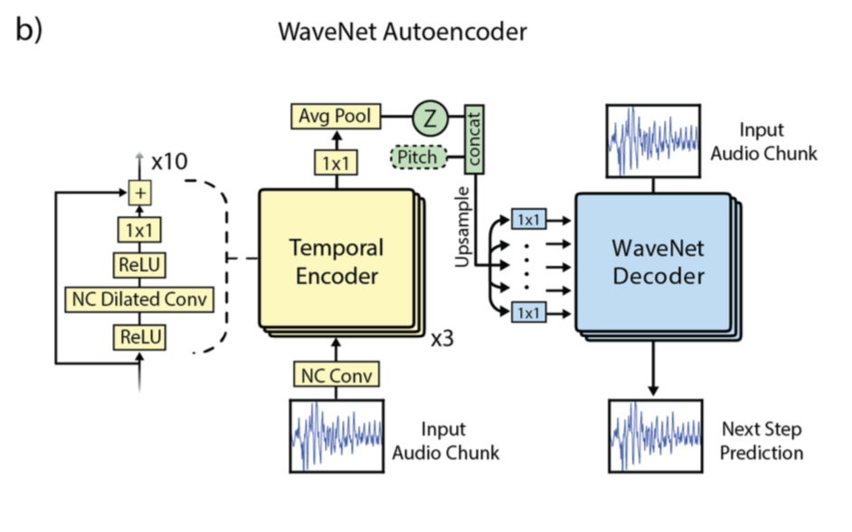

# Neural Audio Synthesis of Musical Notes with WaveNet Autoencoders

Link: https://arxiv.org/abs/1704.01279

Authors: Engel et al.

Institution: Google Brain, DeepMind

## Background Materials

- [NSynth: Neural Audio Synthesis](https://magenta.tensorflow.org/nsynth)
- [WaveNet: A Generative Model for Raw Audio](https://arxiv.org/abs/1609.03499)

## What is this paper about?

- WaveNet style autoencoder models capable of capturing long term dependencies without external conditioning
- invention of NSynth, large-scale dataset of musical notes that is an order of magnitude larger than public dataset
- WaveNet autoencorder is evaluated with NSynth and shows qualitative and quantitative improvements.

## What is the motivation of this research?

- Recent autoregressive models like WaveNet and SampleRNN are proved to be effective at modeling short and medium scale (~500ms) but rely on external conditioning for long-term dependencies. Their autoencorder removes the need for the external conditioning.
- Recent breakthroughs in generative modeling of images have been predicted on the availability of high-quality and large-scale datasets. The same can be applied to audio dataset.

## What makes this paper different from previous research?

- The original WaveNet lacks longer term structure under unconditional generation and results in audio containing "babbling" (sample audio are linked in the papaer). To capture long term dependencies external conditioning is required. The WaveNet autoencoder presented here is capable of capturing long term structure without external conditioning.
- NSynth consists of ~300k four-second annotated notes samples at 16kHz and includes ~1k musical instruments. This is an order of magnitude larger than comparative public dataset.

## How this paper achieve it?

### Basic theory
In WaveNet, joint proberbility of audio x is

$p(x) = \Pi_{i=1}^Np(x_i|x_1,x_2,...x_{N-1})$

The autoencorder introduce embedding Z = f(x) produced by the encorder and fed into the decorder. The joint proberbility is now

$p(x) = \Pi_{i=1}^Np(x_i|x_1,x_2,...x_{N-1},f(x))$

During inference the embedding is used as condition to generate a single output sample.

### Neural network structure

#### temporal encoder model
1. 30-layer residual network of dilated convolutions
1. 1x1 convolutions with 128 channels each
1. ReLU nonlinearity
1. 1x1 convolution
1. average pooling to get the encoding Z

#### WaveNet decoder model
1. upsample the temporal embedding to the original audio rate with nearest neighbor interpolation
1. conditioned by biasing every layer with different projection of the temporal embeddings
1. quantize into 256 value and predict with softmax classifier

### NSynth dataset

- 306043 musical notes
- each note has a unique pitch, timbre and envelope
- 1006 instruments
- 4 second monophonic 16kHz audio
- annotations with source (acoustic or electronic), instrument family and quality

### Evaluation

#### Qualitative comparison

By visualizing audio with constant-q transform (Brown, 1991) spectrogram, the WaveNet audoencoder can reproduce structures compared to baseline.

#### Quantitative comparison

Quantitative evaluation is based on classification accuracy of reconstructed pitch and quality with multi-task neural network, that is analogous way to Inception Score (Salimans et al., 2016).

The WaveNet reconstruction is superior to baseline.

## Implementations

- [tensorflow/magenta](https://github.com/tensorflow/magenta/tree/master/magenta/models/nsynth)

## Further Readings

- [SampleRNN: An Unconditional End-to-End Neural Audio Generation Model](https://arxiv.org/abs/1612.07837)
