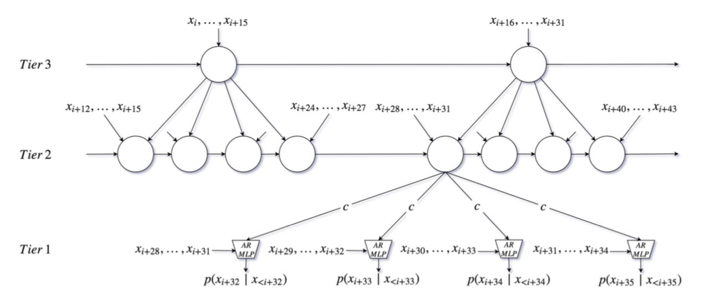

# SampleRNN: An Unconditional End-to-End Neural Audio Generation Model

Link: https://arxiv.org/abs/1612.07837

Authors: Mehri et al.

Institution: University of Montreal, IIT Kanpur, SSNCE

## Background Materials

## What is this paper about?

- unconditional sample level audio generation model using RNN

## What is the motivation of this research?

RNN is good for modeling long term dependencies in audio data.
However it is not scalable at high temporal resolution.
WaveNet is successfully able to model such high temporal resolution
but cannot memorize long term dependencies.

## What makes this paper different from previous research?

- using RNN for sample level audio generation
- can model longer term dependencies than WaveNet while it shows
better quality proved by human evaluation
- can be generalized to different dataset in nature

## How this paper achieve it?

RNN can be formulated as,

$h_t = \mathcal{H}(h_{t-1}, x_{i=t})$
$p(x_{x+i}|x_1,...,x_i) = \mathit{Softmax}(\mathit{MLP}(h_t))$

where $\mathcal{H}$ is one of the memory cells, Gated Recurrent Units (GRUs), Long Short Term Memory Units (LSTMs) and $MLP$ is multi-layer perceptron.

Audio data is challenging for RNN because correlations of samples span ones thousands of samples.

SampleRNN solves that difficulty by using hierarchy of models, each operation at a different temporal resolution.

Each module conditions the module below and the lowest module outputs sample-level predictions.

Modules is divided into two parts.

- frame-level modules
- sample-level modules

### frame-level modules

- higher level modules in SampleRNN
- operates on non-overlapping frames

memory update at tier $k$ is function of the previous memory $h^{(k)}_{t-1}$ and input $\mathcal{inp}^{k}_t$

$h_t = \mathcal{H}(h_{t-1}, \mathit{inp}_t)$

Each conditioning vector $c$ in tier k is upsampled into series of $r$ vectors, where $r$ is temporal resolution ratio between modules.

$c^{(k)}_{(t-1)*r+j} = W_jh_t$ $1 \leq j \leq r$

The input $\mathit{inp}_t$ at tier $k$ is linear combination of conditioning vector $c$ from higher tier and current input frame.

$\mathit{inp}_t = W_xf^{(k)}_t + c^{k+1}_t$ $1 < k < K$

The input for top tier $k = K$ is imput frame.

$\mathit{inp}_t = f^{(k)}_t$ $k = K$

Figure 1 shows snapshot of the model at timestamp $i$ with $K = 3$ tiers and up-sampling ratio $r = 4$.

### sample-level modules

- the lowest module in Sample RNN hierarchy

The input at the lowest tier $k = 1$ is linear combination of a frame $f$ and conditioning vector $c$ from above tier.

$\mathit{inp}^{(1)}_t = W^{(1)}_xf^{(1)}_i + c^{(2)}_i$

The output audio signal is discretized (like WaveNet) by q-way Softmax where q = 256. This outperform continuous distribution using GMM. The quantized output distribution is formulates as

$p(x_{i+1}|x_1,...,x_i) = \mathit{Softmax}(\mathit{MLP}(inp^{(1)}_i))$

The frame is calculated by

$f^{(1)}_{i} = \mathit{flatten}([x_{i - FS^{(1)} + 1},...,x_i])$

where $FS$ is frame size. I have no idea what "flatten" denotes to.
Note that in the paper $x_i$ is replaced by $e_i$, embedding quantized input value. See 2.2.1.

### truncated backpropagation through time (BPTT)

To enable efficient training of the recurrent model they use truncated backpropagation through time.

Truncated BPTT splits each sequence into short subsequences and propagates gradients only to the beginning of each subsequence.

SampleRNN can mimic long term structure with truncated BPTT because top tiers are designed to model a lower resolution.

### Results

 Generated samples can be found at [soundcloud](https://soundcloud.com/samplernn/sets).

 SampleRNN (3-tier and 2-tier) outperforms WaveNet and RNN baseline in human evaluation votes.

 Memory span of SampleRNN is measured in different ways. One of the results is quoted below.

 > Each speaker has roughly 10 hours of audio in the dataset that has been preprocessed similar to Blizzard. We observed that it learned to stay consistent generating samples from the same speaker without having any knowledge about the speaker ID or any other conditioning information.

## Dataset used in this study

- Blizzard (Prahallad et al., 2013)
- Onomatopoeia from Ubisoft
- Music dataset: all 32 Beethoven’s piano sonatas from https://archive.org/

## Implementations

- [soroushmehr/sampleRNN_ICLR2017](https://github.com/soroushmehr/sampleRNN_ICLR2017)

## Further Readings

- [Char2Wav: End-to-End Speech Synthesis](http://www.josesotelo.com/speechsynthesis/)
